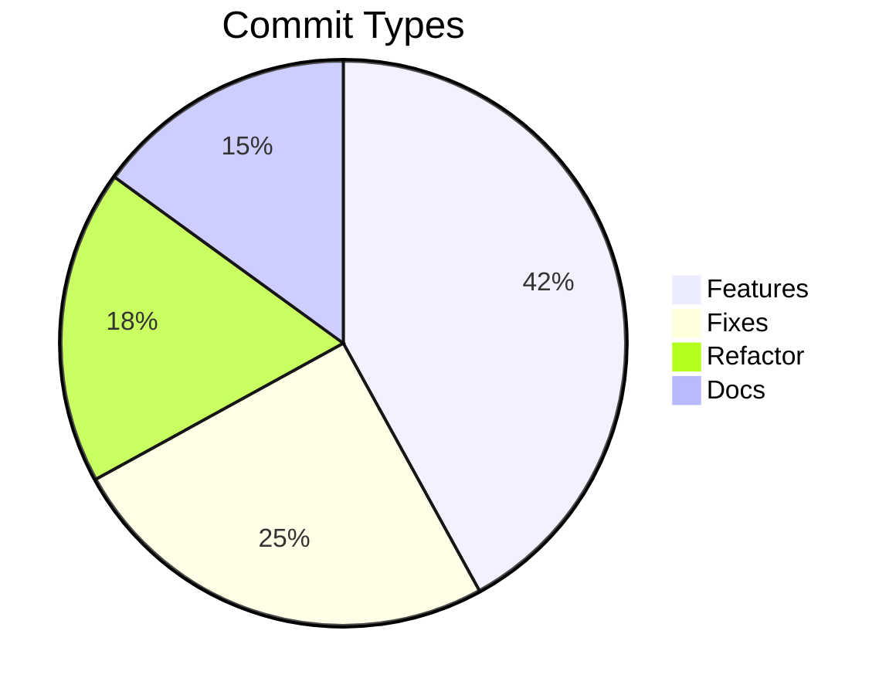

# Deep Wiki: Changelog Generation

Generate a categorized changelog from git commit history.

## Process

### Step 1: Source Repository Resolution

1. Run `git remote get-url origin` to detect remote URL
2. Ask the user if not already provided: _"Source repo URL? (or 'local' for local-only citations)"_
3. Determine branch: `git rev-parse --abbrev-ref HEAD`
4. Store citation format:
   - **Remote**: `[file:line](REPO_URL/blob/BRANCH/file#Lline)`
   - **Local**: `(file:line)`

### Step 2: Get Commit History

```bash
# Get last 50 commits with hash, author, date, message
git log --oneline --decorate --color=never -n 50 --pretty=format:"%h - %an, %ar : %s"
```

### Step 3: Categorize Commits

Group commits by type:
- **Features**: New functionality
- **Fixes**: Bug fixes
- **Performance**: Optimization improvements
- **Refactor**: Code structure changes
- **Docs**: Documentation updates
- **Tests**: Test additions/improvements
- **Chore**: Build/deploy/config changes
- **Breaking**: Backward-incompatible changes

### Step 4: Generate Changelog

Create `CHANGELOG.md` with:

```markdown
# Changelog

All notable changes to this project will be documented in this file.

## [Unreleased]

### Features
- Add user authentication system ([a1b2c3d](REPO_URL/commit/a1b2c3d))
- Implement caching layer ([e4f5g6h](REPO_URL/commit/e4f5g6h))

### Fixes
- Fix session timeout bug ([i7j8k9l](REPO_URL/commit/i7j8k9l))
- Correct API response validation ([m1n2o3p](REPO_URL/commit/m1n2o3p))

### Performance
- Optimize database queries ([q4r5s6t](REPO_URL/commit/q4r5s6t))
- Reduce memory usage in cache ([u7v8w9x](REPO_URL/commit/u7v8w9x))

### Breaking Changes
- Change authentication API ([y1z2a3b](REPO_URL/commit/y1z2a3b))

## [1.0.0] - 2024-01-01

### Initial Release
- Core functionality implemented
- Basic documentation added
```

### Step 5: Add Visualizations (Optional)

Include Mermaid diagrams for:
- Commit frequency over time
- Contributor activity
- Change type distribution


<!-- Sources: git log analysis -->

### Requirements

- Link commit hashes to remote repo when available
- Use semantic versioning format
- Include date for each version
- Group by change type
- Highlight breaking changes

$ARGUMENTS
