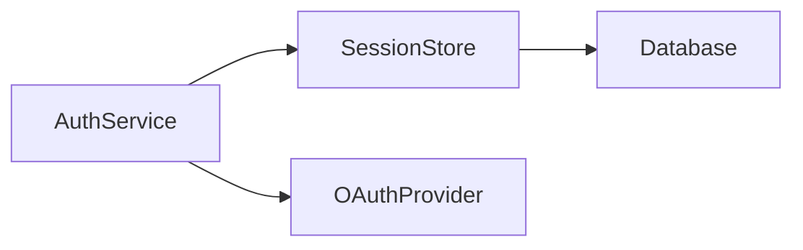
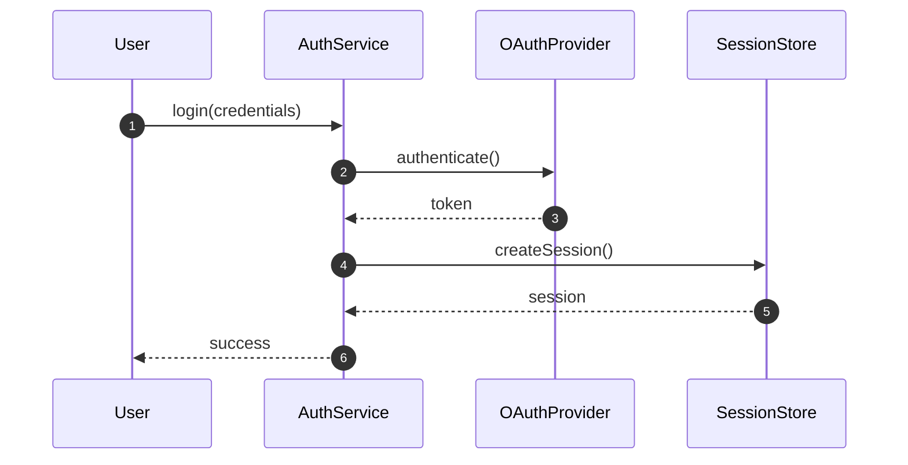

# Deep Wiki: Single Page Generation

Generate a comprehensive documentation page for a specific topic with rich Mermaid diagrams and evidence-based content.

## Process

### Step 1: Source Repository Resolution

1. Run `git remote get-url origin` to detect remote URL
2. Ask the user if not already provided: _"Source repo URL? (or 'local' for local-only citations)"_
3. Determine branch: `git rev-parse --abbrev-ref HEAD`
4. Store citation format:
   - **Remote**: `[file:line](REPO_URL/blob/BRANCH/file#Lline)`
   - **Local**: `(file:line)`

### Step 2: Analyze Topic

Read all relevant source files for the specified topic. Trace actual implementations, don't guess from file names.

### Step 3: Generate Page

Create a Markdown file with:

- **Frontmatter**: `title`, `description`, `outline: deep`
- **Overview**: 1–2 paragraphs explaining WHY this component exists
- **Summary Table**: At-a-glance component overview (purpose, key file, source)
- **Diagrams**: 3–5 Mermaid diagrams (mix of types: architecture, sequence, class, state, ER)
- **Content**: Detailed explanation with tables and code citations
- **Related Pages**: Links to connected wiki pages
- **References**: Source citations

### Requirements

- Minimum 3–5 Mermaid diagrams with `<!-- Sources: ... -->` comment blocks
- At least 2 different diagram types
- Minimum 5 source file citations
- Use `autonumber` in sequence diagrams
- Dark-mode colors: fills `#2d333b`, borders `#6d5dfc`, text `#e6edf3`
- Tables over prose — include "Source" column
- Cross-reference related pages

### Example Structure

```markdown
---
title: Authentication System
description: How authentication works in Project Name
outline: deep
---

# Authentication System

The authentication system handles user login, session management, and authorization. It integrates with OAuth providers and maintains local sessions.

## At-a-Glance

| Component | Responsibility | Key File | Source |
|-----------|---------------|----------|--------|
| AuthService | Core auth logic | `src/auth/service.ts` | [src/auth/service.ts:1](REPO_URL/blob/BRANCH/src/auth/service.ts#L1) |
| SessionStore | Session storage | `src/auth/session.ts` | [src/auth/session.ts:1](REPO_URL/blob/BRANCH/src/auth/session.ts#L1) |

## Architecture


<!-- Sources: src/auth/service.ts:1, src/auth/session.ts:1 -->

## Login Flow


<!-- Sources: src/auth/service.ts:42-68 -->

## Related Pages

- [Data Flow](../02-architecture/data-flow.md) — How data moves through the system
- [API Endpoints](../04-api/endpoints.md) — Authentication API reference

## References

- [src/auth/service.ts:1](REPO_URL/blob/BRANCH/src/auth/service.ts#L1)
- [src/auth/session.ts:1](REPO_URL/blob/BRANCH/src/auth/session.ts#L1)
```

$ARGUMENTS
